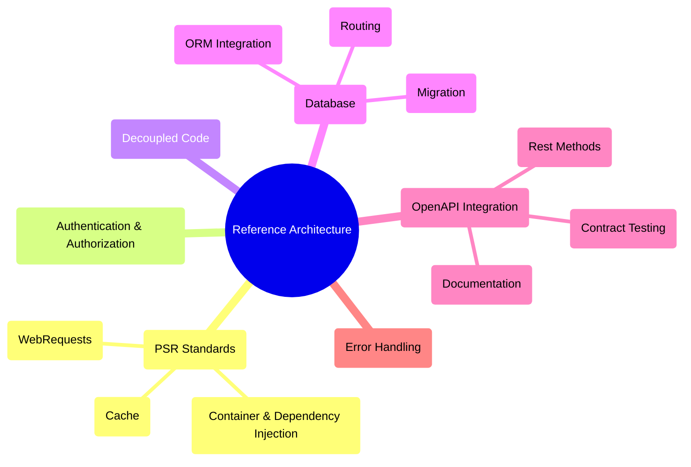

# Reference Architecture project for RESTFul services in PHP

This project is a boilerplate for create Rest Applications API Ready to Use with the best techniques to improve your productivity.

## What is a PHP Rest Template?

It is a PHP-based RESTful API template or boilerplate that aims to simplify the development process of RESTful web services in PHP.
It provides a foundation or starting point for building APIs following REST architectural principles.

Using this PHP Rest Reference Architecture you can focus on the business logic of your application and not in the infrastructure as for example:

- Rapid Development: By offering a pre-defined structure and essential components, the template can expedite the process of building RESTful APIs in PHP.
- Standardization: The template promotes consistency and adherence to RESTful design principles, making it easier for developers to understand and collaborate on the codebase.
- Customizable: Developers can modify and extend the template to fit their specific requirements, allowing for flexibility in implementing additional features or business logic.

Key features and components:

- Uses [OpenAPI](https://swagger.io/specification/) specification for API documentation and endpoint creation.
- Routing: Includes a routing system that helps map incoming HTTP requests to specific API endpoints or resources.
- Middleware: It allows developers to add custom logic or perform operations before and after the request is processed.
- Handling: The project offer utilities to handle and parse incoming requests, extract parameters, and handle request methods (GET, POST, PUT, DELETE, etc.).
- Response Formatting: It provides mechanisms to format and structure API responses, including JSON serialization, error handling, and status codes.
- Authentication and Authorization: The template include support for implementing authentication and authorization mechanisms to secure API endpoints using JWT.
- Database Integration: It offers integration for connecting to databases, executing queries, and managing data persistence.
- Error Handling: The project include error handling mechanisms to properly handle and format error responses.
- Dependency Injection: It includes support for dependency injection and inversion of control (IoC) containers.
- Testing: It includes support for testing the API endpoints and resources, including unit testing and functional testing.
- PHP Standards: PSR-7 (Http Message Interface), PSR-11 (Container), PSR-16 and PSR-6 (Cache Interface) and others.

This project is not a framework. It is a template that you can use to create your own project. You can use the template as a starting point for your own project and customize it to fit your specific requirements.

## Some Features Explained

This project install the follow components (click on the link for more details):

- [Rest Methods API integrated with OpenAPI](docs/rest.md)
- [Functional Unit Tests of your Rest Method API](docs/functional_test.md)
- [PSR-11 Container and different environments](docs/psr11.md)
- [Dependency Injection](docs/psr11_di.md)
- [Login Integration with JWT](docs/login.md)
- [Database Migration](docs/migration.md)
- [Database ORM](docs/orm.md)

## Getting Started

Here some examples of how to use the template:

- [Getting Started, Installing and create a new project](docs/getting_started.md)
- [Add a new Table](docs/getting_started_01_create_table.md)
- [Add a new Field](docs/getting_started_02_add_new_field.md)
- [Add a new Rest Method](docs/getting_started_03_create_rest_method.md)

----
[Open source ByJG](http://opensource.byjg.com)
