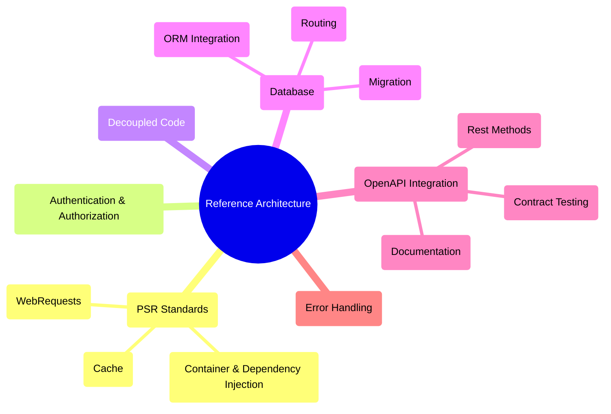

# PHP REST Reference Architecture

[](https://github.com/byjg/php-rest-template/actions/workflows/build-app-image.yml)
[](http://opensource.byjg.com)
[](https://github.com/byjg/php-rest-template/)
[](https://opensource.byjg.com/opensource/licensing.html)
[](https://github.com/byjg/php-rest-template/releases/)
[](https://scrutinizer-ci.com/g/byjg/php-rest-template/?branch=master)

**Production-ready PHP REST API boilerplate** that lets you focus on building your business logic, not the infrastructure.

## Why Use This?

Stop wasting time configuring infrastructure. This template provides everything you need to build professional REST APIs:

- ✅ **Start coding in minutes** - Not hours or days
- ✅ **Production-ready** - Security, authentication, and best practices built-in
- ✅ **Code generator** - Automatically create CRUD operations from database tables
- ✅ **Two architectural patterns** - Choose between Repository or ActiveRecord
- ✅ **OpenAPI documentation** - Auto-generated, always in sync
- ✅ **Fully tested** - Includes a functional test suite
- ✅ **Docker-ready** - Containerized development and deployment

## Quick Start

```bash
# Create your project
composer -sdev create-project byjg/rest-reference-architecture my-api ^6.0

# Start containers
cd my-api
docker compose -f docker-compose-dev.yml up -d

# Run migrations
composer migrate -- --env=dev reset --yes

# Your API is ready!
curl http://localhost:8080/sample/ping
```

**📚 [Complete Getting Started Guide →](docs/getting_started.md)**

## Architecture Overview



## Key Features

### 🚀 Code Generation
Automatically generate Models, Repositories, Services, REST Controllers, and Tests from your database schema.

```bash
composer codegen -- --env=dev --table=users all --save
```

**📚 [Code Generator Documentation →](docs/code_generator.md)**

### 🏗️ Two Architectural Patterns

**Repository Pattern** (default)
- Clean separation of concerns
- Service layer for business logic
- Full dependency injection

**ActiveRecord Pattern**
- Rapid prototyping
- Less boilerplate
- Direct database access from models

**📚 [Choose Your Pattern →](docs/code_generator.md#what-it-generates)**

### 🔐 Authentication & Authorization Built-in

- JWT-based authentication
- Role-based access control (RBAC)
- Secure by default
- Ready-to-use login endpoints

**📚 [Authentication Guide →](docs/login.md)**

### 📖 OpenAPI Integration

- Auto-generated documentation
- Interactive API explorer (Swagger UI)
- Always synchronized with your code
- Contract testing support

**📚 [REST API Documentation →](docs/rest.md)**

### 🗄️ Database Management

**Migrations**
- Version control your database schema
- Up/down migration support
- Zero-downtime deployments

**📚 [Migration Guide →](docs/migration.md)**

**ORM Integration**
- MicroORM for lightweight data access
- Query builder
- Relationship mapping

**📚 [ORM Documentation →](docs/orm.md)**

### 🧪 Testing Built-in

- Functional test suite included
- Test helpers and fixtures
- OpenAPI contract testing
- Supports custom test scenarios

**📚 [Testing Guide →](docs/functional_test.md)**

### 🐳 Docker Ready

- Pre-configured Docker setup
- Development and production configurations
- MySQL, PHP-FPM, and Nginx
- One command to start

### 🔧 Scriptify - Interactive Development

- **Interactive PHP Terminal**: REPL with your project's autoloader
- **CLI Script Runner**: Execute any PHP method from command line
- **Service Management**: Install PHP classes as system daemons
- Quick prototyping and debugging

```bash
composer terminal  # Start interactive PHP shell
```

**📚 [Scriptify Guide →](docs/scriptify.md)**

### ⚙️ Modern PHP Standards

Implements PSR standards:
- PSR-7: HTTP Message Interface
- PSR-11: Container Interface
- PSR-6 & PSR-16: Cache Interface
- And more...

**📚 [PSR-11 Container →](docs/psr11.md)** | **[Dependency Injection →](docs/psr11_di.md)**

## What's Included

| Feature              | Description                        | Documentation                      |
|----------------------|------------------------------------|------------------------------------|
| **Code Generator**   | Generate CRUD from database tables | [→ Docs](docs/code_generator.md)   |
| **REST API**         | OpenAPI-documented endpoints       | [→ Docs](docs/rest.md)             |
| **Authentication**   | JWT with role-based access         | [→ Docs](docs/login.md)            |
| **Database**         | Migrations + ORM                   | [→ Docs](docs/migration.md)        |
| **Testing**          | Functional test suite              | [→ Docs](docs/functional_test.md)  |
| **Service Layer**    | Business logic separation          | [→ Docs](docs/services.md)         |
| **Scriptify**        | Interactive terminal & CLI scripts | [→ Docs](docs/scriptify.md)        |
| **Unattended Setup** | CI/CD friendly installation        | [→ Docs](docs/unattended_setup.md) |

## Documentation

### Getting Started
1. **[Installation & Setup](docs/getting_started.md)** - Get up and running in minutes
2. **[Create Your First Table](docs/getting_started_01_create_table.md)** - Database setup and migrations
3. **[Add Fields](docs/getting_started_02_add_new_field.md)** - Modify existing tables
4. **[Create REST Endpoints](docs/getting_started_03_create_rest_method.md)** - Build your API

### Core Features
- **[Code Generator](docs/code_generator.md)** - Automate CRUD creation
- **[REST API](docs/rest.md)** - Build REST endpoints with OpenAPI
- **[Authentication](docs/login.md)** - JWT and authorization
- **[Database Migration](docs/migration.md)** - Version control your schema
- **[ORM](docs/orm.md)** - Data access layer
- **[Service Layer](docs/services.md)** - Business logic organization
- **[Testing](docs/functional_test.md)** - Test your APIs

### Advanced Topics
- **[Attributes System](docs/attributes.md)** - ValidateRequest, RequireRole, and custom attributes
- **[Advanced Repository Patterns](docs/repository-advanced.md)** - Complex queries, UUID handling, transactions
- **[Service Patterns](docs/service-patterns.md)** - Business logic, validation, service composition
- **[Traits Reference](docs/traits.md)** - Timestamp management (CreatedAt, UpdatedAt, DeletedAt)
- **[Error Handling](docs/error-handling.md)** - Exception types, validation errors, best practices
- **[Complete Testing Guide](docs/testing-guide.md)** - FakeApiRequester, integration tests, unit tests
- **[JWT Authentication Advanced](docs/jwt-advanced.md)** - Custom claims, token refresh, security
- **[Template Customization](docs/templates.md)** - Customize code generator templates
- **[Configuration Deep Dive](docs/configuration-advanced.md)** - Environment inheritance, credentials management
- **[Architecture Decisions](docs/architecture-decisions.md)** - Repository vs ActiveRecord, when to use what

### Infrastructure
- **[PSR-11 Container](docs/psr11.md)** - Dependency injection container
- **[Dependency Injection](docs/psr11_di.md)** - DI patterns and usage
- **[Scriptify](docs/scriptify.md)** - Interactive terminal, CLI script runner, and service management
- **[Unattended Setup](docs/unattended_setup.md)** - Automated installation for CI/CD
- **[Windows Setup](docs/windows.md)** - Windows-specific instructions

## Real-World Example

```bash
# 1. Create database table
cat > db/migrations/up/00002-create-products.sql << 'EOF'
CREATE TABLE products (
    id INT AUTO_INCREMENT PRIMARY KEY,
    name VARCHAR(100) NOT NULL,
    price DECIMAL(10,2) NOT NULL,
    created_at TIMESTAMP DEFAULT CURRENT_TIMESTAMP
);
EOF

# 2. Run migration
composer migrate -- --env=dev update

# 3. Generate all code
composer codegen -- --env=dev --table=products all --save

# 4. Your CRUD API is ready!
curl http://localhost:8080/products
```

You just created a complete CRUD API with:
- ✅ Model with validation
- ✅ Repository for data access
- ✅ Service for business logic
- ✅ REST controller with GET, POST, PUT endpoints
- ✅ Functional tests
- ✅ OpenAPI documentation
- ✅ JWT authentication

## Requirements

- PHP 8.1+ (8.4 recommended)
- Docker & Docker Compose (optional but recommended)
- Composer
- Git

## Support & Community

- 📖 **[Full Documentation](docs/getting_started.md)**
- 🐛 **[Report Issues](https://github.com/byjg/php-rest-template/issues)**
- 💡 **[Request Features](https://github.com/byjg/php-rest-template/issues)**
- 🌐 **[ByJG Open Source](http://opensource.byjg.com)**

## Not a Framework

This is a **template**, not a framework. You own the code:
- ✅ Full control over every file
- ✅ No vendor lock-in
- ✅ Customize anything you need
- ✅ Remove what you don't need

## License

This project is open source. See [LICENSE](https://opensource.byjg.com/opensource/licensing.html) for details.

---

**[Open source ByJG](http://opensource.byjg.com)**
