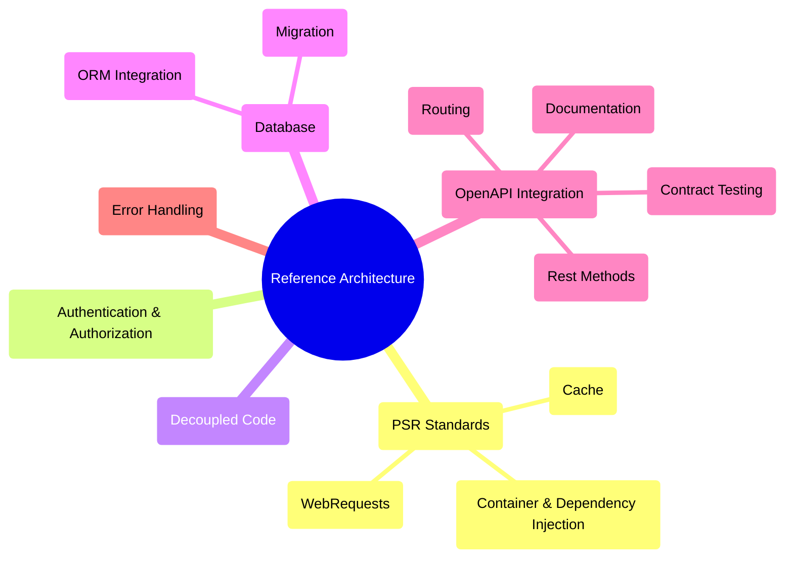

# PHP REST Reference Architecture

[](https://github.com/sponsors/byjg)
[](https://github.com/byjg/php-rest-reference-architecture/actions/workflows/build-app-image.yml)
[](http://opensource.byjg.com)
[](https://github.com/byjg/php-rest-reference-architecture)
[](https://opensource.byjg.com/license/)
[](https://github.com/byjg/php-rest-reference-architecture/releases)

**Production-ready PHP REST API boilerplate** that lets you focus on building your business logic, not the infrastructure.

## Why Use This?

Every new REST API needs the same boilerplate: authentication, migrations, an ORM, OpenAPI docs, a test harness, and a DI container. Setting all of that up correctly takes days — and it's not the work your users care about.

This template does the wiring once, correctly, so you start on day one writing business logic instead of plumbing. And because it's a **template you own** — not a framework you depend on — you can change, remove, or replace any part of it without asking permission.

## Quick Start

```bash
# Create your project
composer -sdev create-project byjg/rest-reference-architecture my-api ^6.0

# Start containers
cd my-api
docker compose up -d

# Run migrations
composer migrate -- --env=dev reset

# Your API is ready!
curl http://localhost:8080/sample/ping
```

**📚 [Complete Getting Started Guide →](docs/getting-started/installation.md)**

## Architecture Overview



## Key Features

- 🚀 **Code generator** — one command scaffolds Model, Repository, Service, REST controller, and tests from any database table
- 🏗️ **Two patterns** — choose Repository (DI + Service layer) or ActiveRecord per entity; mix them in the same project
- 🔐 **Auth out of the box** — JWT login, token refresh, password reset, and role-based access control (RBAC) included
- 📖 **OpenAPI-first** — routes are driven by `openapi.json`; Swagger UI, contract testing, and docs stay in sync automatically
- 🗄️ **Database migrations** — versioned up/down SQL migrations with a one-command runner and ORM integration
- 🧪 **In-process testing** — `FakeApiRequester` runs the full API stack inside PHPUnit, no web server needed
- 🐳 **Docker ready** — MySQL, PHP-FPM, and Nginx pre-configured; `docker compose up -d` and you're running
- ⚙️ **PSR standards** — PSR-7 (HTTP messages), PSR-11 (container), PSR-6/16 (cache)

```bash
# Generate a complete CRUD API from a single table
composer codegen -- --env=dev --table=products all --save
```

## Documentation

### Getting Started
1. **[Installation & Setup](docs/getting-started/installation.md)** – Install the template, configure environments, and review prerequisites.
2. **[Create Your First Table](docs/getting-started/first-table.md)** – Define your first migration and schema.
3. **[Add Fields](docs/getting-started/add-field.md)** – Safely evolve existing tables.
4. **[Create REST Endpoints](docs/getting-started/first-endpoint.md)** – Generate REST handlers from your tables.
5. **[Windows Setup](docs/getting-started/windows.md)** – WSL/Windows-specific checklist.
6. **[Unattended Setup](docs/getting-started/unattended-setup.md)** – Automate installs for CI/CD pipelines.

### Guides
- **[REST Controllers](docs/guides/rest-controllers.md)** – Define routes with PHP attributes; keep controllers thin.
- **[Authentication](docs/guides/authentication.md)** – Configure JWT login flows and RBAC enforcement.
- **[Database Migrations](docs/guides/migrations.md)** – Version and run schema migrations in every environment.
- **[ORM](docs/guides/orm.md)** – Use MicroORM for repository and ActiveRecord patterns.
- **[Service Layer](docs/guides/services.md)** – Organize business logic, orchestration, and transaction boundaries.
- **[Repository Patterns](docs/guides/repository-advanced.md)** – Implement complex queries, UUID handling, and filtering helpers.
- **[Template Customization](docs/guides/templates.md)** – Tailor the generator templates to match your coding standards.
- **[Testing](docs/guides/testing.md)** – Unit, integration, and contract testing with `FakeApiRequester`.
- **[JWT Authentication Advanced](docs/guides/jwt-advanced.md)** – Extend tokens with custom claims and refresh logic.
- **[Error Handling](docs/guides/error-handling.md)** – Map exceptions to HTTP responses and logging patterns.
- **[Configuration](docs/guides/configuration.md)** – Layer configurations, secrets, and environment overrides.

### Concepts
- **[Architecture](docs/concepts/architecture.md)** – Architectural decisions: when to use Repository vs ActiveRecord.
- **[OpenAPI Integration](docs/concepts/openapi-integration.md)** – How swagger-php, the spec file, and Swagger UI fit together.
- **[Dependency Injection](docs/concepts/dependency-injection.md)** – PSR-11 container, environment hierarchy, and DI binding patterns.
- **[Request Lifecycle](docs/concepts/request-lifecycle.md)** – Trace an HTTP request from entry point to JSON response.

### Reference
- **[Code Generator](docs/reference/code-generator.md)** – Automate models, repositories, services, controllers, and tests.
- **[Attributes](docs/reference/attributes.md)** – `RequireAuthenticated`, `RequireRole`, `ValidateRequest`, and custom attributes.
- **[Traits](docs/reference/traits.md)** – Timestamp and soft-delete helpers for models.
- **[Scriptify](docs/reference/scriptify.md)** – REPL, CLI runner, and service manager utilities.
- **[Components](docs/reference/components.md)** – Full PHP component dependency graph.

## Real-World Example

```bash
# 1. Create database table
cat > db/migrations/up/00002-create-products.sql << 'EOF'
CREATE TABLE products (
    id INT AUTO_INCREMENT PRIMARY KEY,
    name VARCHAR(100) NOT NULL,
    price DECIMAL(10,2) NOT NULL,
    created_at TIMESTAMP DEFAULT CURRENT_TIMESTAMP
);
EOF

# 2. Run migration
composer migrate -- --env=dev update

# 3. Generate all code
composer codegen -- --env=dev --table=products all --save

# 4. Generate the OpenAPI spec so routing is active
composer run openapi

# 5. Log in and capture the token
TOKEN=$(curl -s -X POST http://localhost:8080/login \
  -H "Content-Type: application/json" \
  -d '{"username":"admin@example.com","password":"!P4ssw0rdstr!"}' \
  | jq -r '.token')

# 6. Call your new endpoint
curl -s -H "Authorization: Bearer $TOKEN" http://localhost:8080/products | jq
```

You just created a complete CRUD API with:
- ✅ Model with validation
- ✅ Repository for data access
- ✅ Service for business logic
- ✅ REST controller with GET, POST, PUT endpoints
- ✅ Functional tests
- ✅ OpenAPI documentation
- ✅ JWT authentication

## Requirements

- PHP 8.3+ (8.5 recommended)
- Docker & Docker Compose (optional but recommended)
- Composer
- Git

## Support & Community

- 📖 **[Full Documentation](docs/getting-started/installation.md)**
- 🐛 **[Report Issues](https://github.com/byjg/php-rest-reference-architecture/issues)**
- 💡 **[Request Features](https://github.com/byjg/php-rest-reference-architecture/issues)**
- 🌐 **[ByJG Open Source](http://opensource.byjg.com)**

## Not a Framework

This is a **template**, not a framework. You own the code:
- ✅ Full control over every file
- ✅ No vendor lock-in
- ✅ Customize anything you need
- ✅ Remove what you don't need

## License

This project is open source. See [LICENSE](https://opensource.byjg.com/opensource/licensing.html) for details.

## Dependencies

**📚 [Complete Component Dependency Graph →](docs/reference/components.md)**

---

**[Open source ByJG](http://opensource.byjg.com)**
