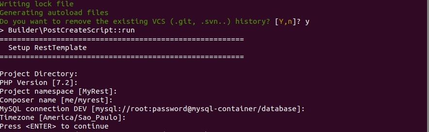

# Boilerplate Project Template for RESTFul API

[](http://opensource.byjg.com)
[](https://travis-ci.org/byjg/php-rest-template)
[](https://scrutinizer-ci.com/g/byjg/php-rest-template/?branch=master)

This project enables you to create a full functional project for RESTFul server Api.

This project install the follow components:
- PSR11 Container dependency
- A JWT Authentication
- Pre-configured for different environments (DEV, HOMOLOG, LIVE, etc)
- Database
- Docker for build your project 

# Install

## Requirements

This project requires in order to run:
 - PHP
 - composer
 - Docker. 

**Installing Docker**

Follow the instructions for your environment at dockers web site.


**Installing PHP**

On `Debian` systems just do:

```bash
sudo apt install composer php php-sqlite php-mysql
```

On Windows system the easiest way is installing from [Chocolatey](https://chocolatey.org/install). 
Once chocolatey is installed you can just do:

```bash
choco install -y php composer
```

## Stable Release

```bash
composer create-project byjg/resttemplate YOURPATH 4.0.*
```

## Dev Release

```bash
composer -sdev create-project byjg/resttemplate YOURPATH master
```

# How to use

## Start

After the command create-project is executed some questions will be asked for setup your new project.



You need also a MySQL installation. You can use docker if you want:

```bash
docker run -d --rm \
    --name mysql-container  \
    -e MYSQL_ROOT_PASSWORD=password \
    -v mysql:/var/lib/mysql \
    -p 3306:3306 \
    mysql:5.7
``` 

## PSR-11

This project uses a PSR11 implementation for container. 
The implementation is from [byjg/config](https://github.com/byjg/config). 

Start editing from "config/config-dev"

## Build

The build process will enable you create an artifact of your project. 
The "Builder" can easily turn your project inside a docker container.

The ready to use command is:

```bash
# Set the correct environment
export APPLICATION_ENV=dev

# Create the database
composer migrate -- reset --yes

# Update the database
composer migrate -- update    # or reset if you want to recreate

# Build
composer docker-build

# Run
composer docker-run
```

## Build TL;DR

The build process uses the configuration environment defined in the PSR11 Container 

The process for build is:
- Read the PSR11 Container with the specific environment;
- If exists PSR11 "BUILDER_DOCKERFILE" variable it will copy the Dockerfile template from 'docker/Dockerfile' 
to the workdir and apply the customizations;
- Run the commands inside the PSR11 "BUILDER_DOCKER_BUILD" variable
- Run the commands inside the PSR11 "BUILDER_DOCKER_RUN" variable

Your PSR11 Container must have the follow variables:

- BUILDER_VARIABLES => an array with custom variables. By default there are:
    - %env% - Your current environment
    - %workdir% - The root workdir
- BUILDER_DOCKERFILE: an array with specific commands for the current environment. Basically
the build process will copy the docker template file from 'docker/Dockerfile' and replace the 
string comment `##---ENV-SPECIFICS-HERE` with the commands defined here; **IMPORTANT NOTE**: if the array is empty
or null, the Builder will ignore the custom Dockerfile
- BUILDER_DOCKER_BUILD =>The commands used to build your artifact. 
- BUILDER_DOCKER_RUN: The commands used to deploy your artifact. Maybe a docker run command or 
a docker push or everything else.;


# Migrate database

The sample database requires you have a MySQL running. 


**Update to the most recent database version**

```bash
APPLICATION_ENV=dev composer migrate -- update
```

**Reset the database**

```bash
APPLICATION_ENV=dev composer migrate -- reset --yes
```

Note: be careful with this command, because all of your database will erased 
and recreated with the migrations scripts.

# Database TL;DR

## Migration

The migration process uses the [byjg/migration](https://github.com/byjg/migration)

Basically there are migration scripts located at "%workdir%/db".

The initial file is "base.sql" and the migration are "%workdir%/db/up/1.sql", "%workdir%/db/up/2.sql" and so on. 

The basic migrations command are:
- reset: Will reset the database starting from "base.sql" and apply an migrations starting from 1.sql.
- update: Will update the database until the most recent version existing in the migration;
- update --up-to=n: Will update the database until the version 'n' existing in the migration;

The connection is in the Psr11 container variable 'DBDRIVER_CONNECTION';

## ORM

The ORM uses the [byjg/micro-orm](https://github.com/byjg/micro-orm)

There are a basic example in "%workdir%/src/project/Repository/DummyRepository". 
The defintion in the Psr11 container variable 'DUMMY_TABLE'

# Test

To run the tests you need to start the database and build the project. 

After all, you have to setup the environment and the username for test

```php
export APPLICATION_ENV=dev
export TEST_ADMIN_USER=admin
export TEST_ADMIN_PASSWORD=pwd
export TEST_REGULAR_USER=user
export TEST_REGULAR_PASSWORD=pwd
vendor/bin/phpunit
```

# Fix problems

## SQLSTATE[HY000] [1049] Unknown database 'database'

```bash
export APPLICATION_ENV=dev
composer migrate -- reset --yes
```

## How to setup the environment APPLICATION at Windows command prompt?

Use the `set` command.

```cmd
set APPLICATION_ENV=dev
```


----
[Open source ByJG](http://opensource.byjg.com)
