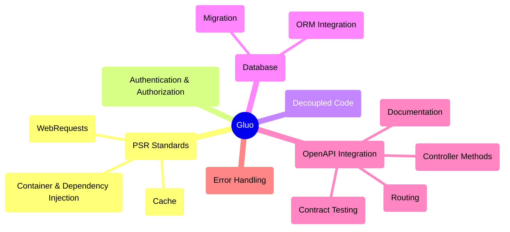

# Gluo — PHP REST API Starter

[](https://github.com/sponsors/byjg)
[](https://github.com/byjg/php-gluo/actions/workflows/build-app-image.yml)
[](http://opensource.byjg.com)
[](https://github.com/byjg/php-gluo)
[](https://opensource.byjg.com/license/)
[](https://github.com/byjg/php-gluo/releases)

**Gluo** (Esperanto for *glue*) is a **production-ready PHP REST API starter**: create a project you fully own, powered by an updatable framework core — so you focus on business logic, not infrastructure.

## Why Use This?

Every new REST API needs the same boilerplate: authentication, migrations, an ORM, OpenAPI docs, a test harness, and a DI container. Setting all of that up correctly takes days — and it's not the work your users care about.

Gluo splits the problem the right way:

- **Your project** (`composer create-project byjg/gluo`) — a full-stack monorepo: the PHP REST API in `api/`, an optional Vite + React frontend in `html/`, plus `docker-compose.yml` and `docker/`. Generated once, renamed to your namespace, fully yours: change, remove, or replace anything.
- **The framework core** ([`byjg/gluo-core`](https://github.com/byjg/php-gluo-core)) — base classes, auth flow, attributes, code generator, and test harness live in `api/vendor/` and improve with a plain `composer update`. No copy-paste to stay current.

## Quick Start

```bash
# Create your project (the installer asks a few questions — see below)
composer create-project byjg/gluo my-api ^7.0

# Start containers (API, MySQL, and the frontend if you kept it)
cd my-api
docker compose up -d

# Run migrations
composer migrate -- --env=dev reset

# Your API is ready!
curl http://localhost:8080/sample/ping
```

Commands like `composer migrate`, `composer test`, `composer codegen`, `composer openapi`,
and `composer psalm` run from the repository root — the root `composer.json` proxies them
into the `api/` project (they also work from inside `api/`).

### What you get

```
my-api/
├── api/                  # PHP REST API — src/, config/, db/, tests/, public/, composer.json, vendor/
├── html/                 # optional Vite + React frontend (React 19 + Vite 6 + Tailwind)
├── docker/               # Dockerfile (API) + Dockerfile-html (frontend)
├── docker-compose.yml    # API :8080, frontend :7080, MySQL :3306
└── docs/
```

The `create-project` installer offers two toggles:

- **Install Frontend** — keep the `html/` SPA (login, password-reset, dashboard, and profile
  screens, wired to the API over JWT). Say no and `html/`, its Docker image, and the `html`
  compose service are removed, leaving a pure API project.
- **Install Examples** — keep the demo entities (`Project`, `Task`, `Note`) and their frontend
  pages. Say no and you get a clean app shell (auth + profile only, no example CRUD).

|                    | Install Examples: **Yes**            | Install Examples: **No**        |
|--------------------|--------------------------------------|---------------------------------|
| **Frontend: Yes**  | Full-stack demo (auth + example CRUD)| Auth-only app shell (login/profile) |
| **Frontend: No**   | Pure API with example endpoints      | Pure API, clean slate           |

When the frontend is enabled, `docker compose up -d` serves it at **http://localhost:7080**
(via [byjg/static-httpserver](https://github.com/byjg/docker-static-httpserver)) while the API
answers on **http://localhost:8080**. See the **[Frontend guide →](docs/guides/frontend.md)**.

**📚 [Complete Getting Started Guide →](docs/getting-started/installation.md)**

## Architecture Overview


```mermaid
mindmap
  (("Gluo"))
    ("PSR Standards")
      ("WebRequests")
      ("Container & Dependency Injection")
      ("Cache")
    ("Authentication & Authorization")
    ("Decoupled Code")
    ("Database")
      ("ORM Integration")
      ("Migration")
    ("OpenAPI Integration")
      ("Routing")
      ("Controller Methods")
      ("Contract Testing")
      ("Documentation")
    ("Error Handling")
```

## Key Features

- 🚀 **Code generator** — one command scaffolds Model, Repository, Service, REST controller, and tests from any database table
- 🏗️ **Two patterns** — choose Repository (DI + Service layer) or ActiveRecord per entity; mix them in the same project
- 🔐 **Auth out of the box** — JWT login, token refresh, password reset, and role-based access control (RBAC) included
- 📖 **OpenAPI-first** — routes are driven by `openapi.json`; Swagger UI, contract testing, and docs stay in sync automatically
- 🗄️ **Database migrations** — versioned up/down SQL migrations with a one-command runner and ORM integration
- 🧪 **In-process testing** — `FakeApiRequester` runs the full API stack inside PHPUnit, no web server needed
- 🎨 **Optional React frontend** — a Vite + React 19 + Tailwind SPA in `html/` with login, password-reset, dashboard, and profile screens already wired to the API over JWT
- 🐳 **Docker ready** — MySQL, PHP-FPM, Nginx, and the frontend pre-configured; `docker compose up -d` and you're running
- 🔄 **Updatable core** — framework fixes and features arrive with `composer update byjg/gluo-core`; your code stays untouched
- ⚙️ **PSR standards** — PSR-7 (HTTP messages), PSR-11 (container), PSR-6/16 (cache)

```bash
# Generate a complete CRUD API from a single table (run from the repo root)
composer codegen -- --env=dev --table=project all --save
```

## Documentation

### Getting Started
1. **[Installation & Setup](docs/getting-started/installation.md)** – Install the starter, configure environments, and review prerequisites.
2. **[Create Your First Table](docs/getting-started/first-table.md)** – Define your first migration and schema.
3. **[Add Fields](docs/getting-started/add-field.md)** – Safely evolve existing tables.
4. **[Create REST Endpoints](docs/getting-started/first-endpoint.md)** – Generate REST handlers from your tables.
5. **[Windows Setup](docs/getting-started/windows.md)** – WSL/Windows-specific checklist.
6. **[Unattended Setup](docs/getting-started/unattended-setup.md)** – Automate installs for CI/CD pipelines.

### Guides
- **[Frontend (Vite + React)](docs/guides/frontend.md)** – Run and customize the optional `html/` SPA that talks to the API over JWT.
- **[REST Controllers](docs/guides/rest-controllers.md)** – Define routes with PHP attributes; keep controllers thin.
- **[Authentication](docs/guides/authentication.md)** – Configure JWT login flows and RBAC enforcement.
- **[Database Migrations](docs/guides/migrations.md)** – Version and run schema migrations in every environment.
- **[ORM](docs/guides/orm.md)** – Use MicroORM for repository and ActiveRecord patterns.
- **[Service Layer](docs/guides/services.md)** – Organize business logic, orchestration, and transaction boundaries.
- **[Repository Patterns](docs/guides/repository-advanced.md)** – Implement complex queries, UUID handling, and filtering helpers.
- **[Template Customization](docs/guides/templates.md)** – Tailor the generator templates to match your coding standards.
- **[Testing](docs/guides/testing.md)** – Unit, integration, and contract testing with `FakeApiRequester`.
- **[JWT Authentication Advanced](docs/guides/jwt-advanced.md)** – Extend tokens with custom claims and refresh logic.
- **[Error Handling](docs/guides/error-handling.md)** – Map exceptions to HTTP responses and logging patterns.
- **[Configuration](docs/guides/configuration.md)** – Layer configurations, secrets, and environment overrides.

### Concepts
- **[Architecture](docs/concepts/architecture.md)** – Architectural decisions: when to use Repository vs ActiveRecord.
- **[OpenAPI Integration](docs/concepts/openapi-integration.md)** – How swagger-php, the spec file, and Swagger UI fit together.
- **[Dependency Injection](docs/concepts/dependency-injection.md)** – PSR-11 container, environment hierarchy, and DI binding patterns.
- **[Request Lifecycle](docs/concepts/request-lifecycle.md)** – Trace an HTTP request from entry point to JSON response.

### Reference
- **[Code Generator](docs/reference/code-generator.md)** – Automate models, repositories, services, controllers, and tests.
- **[Attributes](docs/reference/attributes.md)** – `RequireAuthenticated`, `RequireRole`, `ValidateRequest`, and custom attributes.
- **[Traits](docs/reference/traits.md)** – Timestamp and soft-delete helpers for models.
- **[Scriptify](docs/reference/scriptify.md)** – REPL, CLI runner, and service manager utilities.
- **[Components](docs/reference/components.md)** – Full PHP component dependency graph.

## Real-World Example

```bash
# 1. Create database table (migrations live under api/)
cat > api/db/migrations/up/00002-create-products.sql << 'EOF'
CREATE TABLE products (
    id INT AUTO_INCREMENT PRIMARY KEY,
    name VARCHAR(100) NOT NULL,
    price DECIMAL(10,2) NOT NULL,
    created_at TIMESTAMP DEFAULT CURRENT_TIMESTAMP
);
EOF

# 2. Run migration
composer migrate -- --env=dev update

# 3. Generate all code
composer codegen -- --env=dev --table=products all --save

# 4. Generate the OpenAPI spec so routing is active
composer run openapi

# 5. Log in and capture the token
TOKEN=$(curl -s -X POST http://localhost:8080/login \
  -H "Content-Type: application/json" \
  -d '{"username":"admin@example.com","password":"!P4ssw0rdstr!"}' \
  | jq -r '.token')

# 6. Call your new endpoint
curl -s -H "Authorization: Bearer $TOKEN" http://localhost:8080/products | jq
```

You just created a complete CRUD API with:
- ✅ Model with validation
- ✅ Repository for data access
- ✅ Service for business logic
- ✅ REST controller with GET, POST, PUT endpoints
- ✅ Functional tests
- ✅ OpenAPI documentation
- ✅ JWT authentication

## Requirements

- PHP 8.3+ (8.5 recommended)
- Docker & Docker Compose (optional but recommended)
- Composer
- Git

## Support & Community

- 📖 **[Full Documentation](docs/getting-started/installation.md)**
- 🐛 **[Report Issues](https://github.com/byjg/php-gluo/issues)**
- 💡 **[Request Features](https://github.com/byjg/php-gluo/issues)**
- 🌐 **[ByJG Open Source](http://opensource.byjg.com)**

## Your Code vs. the Framework

The starter generates a project that is fully yours — `api/src/`, `api/config/`, `api/db/`, `html/`, `docker/`:
- ✅ Full control over every file the generator gave you
- ✅ Base classes are thin extension points (`BaseLoginController`, `BaseRepository`, `BaseService`, …) — override what you need
- ✅ Framework improvements arrive via `composer update byjg/gluo-core`
- ✅ Remove what you don't need — the frontend, auth, examples, and patterns are all optional

## License

This project is open source. See [LICENSE](https://opensource.byjg.com/opensource/licensing.html) for details.

## Dependencies

**📚 [Complete Component Dependency Graph →](docs/reference/components.md)**

---

**[Open source ByJG](http://opensource.byjg.com)**
