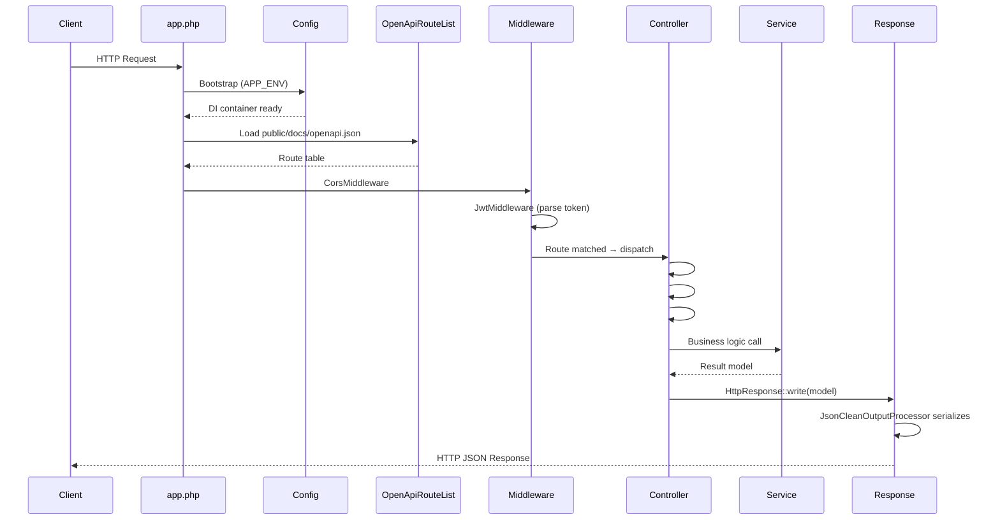

# Request Lifecycle

This page traces the path of a single HTTP request from the moment it arrives at the web server until a JSON response is sent back to the client.

## Overview

Every request is handled in-process without a separate HTTP dispatcher process. The entry point is `public/app.php`, and the entire stack runs inside PHP.

## Step-by-Step Breakdown

### 1. Entry Point — `public/app.php`

The web server (nginx/Apache/built-in) directs all requests to `public/app.php`. This file:

1. Loads the Composer autoloader.
2. Calls `Config::init()` (or lets it auto-initialize on first use) using the `APP_ENV` environment variable.

### 2. Config Bootstrap

`config/ConfigBootstrap.php` defines the environment hierarchy (`dev → test`, `dev → staging → prod`). The DI container is built lazily from the numbered config files (`01-infrastructure.php` … `06-external.php`) inside the active environment's folder.

### 3. Route Loading — `OpenApiRouteList`

`OpenApiRouteList` reads `public/docs/openapi.json` and builds an in-memory routing table. Each `operationId` value in the spec encodes the target class and method name, so no separate routing configuration is needed.

### 4. Middleware Stack

Before the controller is called, two middleware layers run in order:

- **CorsMiddleware** – Adds `Access-Control-*` response headers based on the `CORS_SERVERS` config value.
- **JwtMiddleware** – Extracts and decodes the `Authorization: Bearer <token>` header. A valid token populates the request context with `userid`, `name`, and `role` claims. An absent or invalid token does **not** immediately reject the request here; rejection happens in attribute processing.

### 5. Attribute Processing (inside the controller method)

PHP attribute annotations on the target controller method are evaluated in this order:

1. **`#[RequireAuthenticated]`** – Throws `Error401Exception` if no valid token was found by JwtMiddleware.
2. **`#[RequireRole]`** – Throws `Error403Exception` if the authenticated user's role does not match the required role.
3. **`#[ValidateRequest]`** – Validates the request body against the OpenAPI schema. Throws `Error422Exception` on schema violations. On success, the validated payload is available via `ValidateRequest::getPayload()`.

### 6. Controller Method Execution

The matched controller method runs with `HttpRequest` and `HttpResponse` injected. Controllers are intentionally thin — 3–4 lines — and delegate all business logic to a Service retrieved from the DI container via `Config::get(ServiceClass::class)`.

### 7. Response Serialization

`HttpResponse::write($model)` hands the return value to `JsonCleanOutputProcessor`, which:

- Converts model objects to arrays using getter reflection.
- Strips `null` values (the "clean" part).
- Encodes the result as JSON and writes it to the PSR-7 response body.

The HTTP status code defaults to `200`. Unhandled exceptions are caught by the framework's error handler, which maps known exception classes (e.g., `Error404Exception`) to the appropriate HTTP status codes.

## Related Documentation

- [OpenAPI Integration](openapi-integration.md) - How the spec file drives routing
- [REST Controllers](../guides/rest-controllers.md) - Defining routes and attributes
- [Dependency Injection](dependency-injection.md) - How the DI container is bootstrapped
- [Authentication](../guides/authentication.md) - JWT flow details
