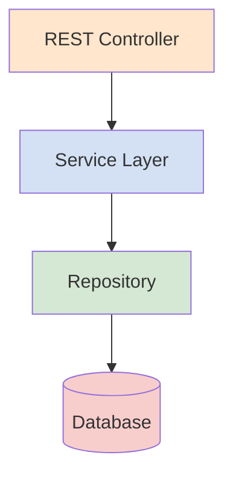

# Service Layer

The Service Layer contains your business logic and orchestrates operations between REST controllers and repositories.

## Architecture Overview



**Separation of Concerns:**
- **REST Controllers** - Handle HTTP requests/responses (3-4 lines per method)
- **Services** - Business logic, validation, orchestration
- **Repositories** - Database access only
- **Models** - Data structures

## BaseService

Every service extends `RestReferenceArchitecture\Service\BaseService`, so you automatically inherit the same safeguards used by the sample `DummyService`/`DummyHexService` classes.

```php title="src/Service/BaseService.php (excerpt)"
abstract class BaseService
{
    public function __construct(protected BaseRepository $baseRepository)
    {
    }

    public function create(array $payload): mixed
    {
        // Reject payloads that try to set the primary key manually
        $primaryKey = $this->baseRepository->getMapper()->getPrimaryKey();
        foreach ($primaryKey as $pkField) {
            if (!empty($payload[$pkField])) {
                throw new Error422Exception("Create should not include primary key field: {$pkField}");
            }
        }

        $model = $this->baseRepository->getMapper()->getEntity($payload);
        $this->baseRepository->save($model);
        return $model;
    }

    public function update(array $payload): mixed
    {
        $primaryKey = $this->baseRepository->getMapper()->getPrimaryKey();
        $pkValue = array_intersect_key($payload, array_flip($primaryKey));
        if (count($pkValue) !== count($primaryKey)) {
            throw new Error422Exception('Update requires primary key field(s): ' . implode(', ', $primaryKey));
        }

        $model = $this->getOrFail($pkValue);
        ObjectCopy::copy($payload, $model);
        $this->baseRepository->save($model);
        return $model;
    }

    public function get(array|string|int|LiteralInterface $id): mixed
    {
        return $this->baseRepository->get($id);
    }

    public function getOrFail(array|string|int|LiteralInterface $id): mixed
    {
        $result = $this->baseRepository->get($id);
        if (empty($result)) {
            throw new Error404Exception('Id not found');
        }
        return $result;
    }

    public function list(?int $page = 0, ?int $size = 20): array
    {
        return $this->baseRepository->list($page ?? 0, $size ?? 20);
    }

    public function save(mixed $model): void
    {
        $this->baseRepository->save($model);
    }

    public function delete(mixed $id): void
    {
        $this->baseRepository->delete($id);
    }
}
```

:::note Why enforce primary keys?
Both `create()` and `update()` rely on the mapper metadata, so composite keys and UUIDs work exactly the same as plain integers. Keeping the rules in one place avoids duplicated validation in each service.
:::

## Creating a Service

### Step 1: Create the Service Class

```php
<?php

namespace RestReferenceArchitecture\Service;

use RestReferenceArchitecture\Repository\ProductRepository;

class ProductService extends BaseService
{
    public function __construct(ProductRepository $repository)
    {
        parent::__construct($repository);
    }

    public function getActiveProducts(): array
    {
        return $this->baseRepository->getByStatus('active');
    }

    public function markAsDiscontinued(int $productId): void
    {
        $product = $this->getOrFail($productId);
        $product->setStatus('discontinued');
        $this->save($product);
    }
}
```

### Step 2: Register in DI Container

Add to `config/dev/05-services.php`:

```php
<?php

use ByJG\Config\DependencyInjection as DI;
use RestReferenceArchitecture\Service\ProductService;

return [
    ProductService::class => DI::bind(ProductService::class)
        ->withInjectedConstructor()
        ->toSingleton(),
];
```

:::tip
When using the code generator with `--save`, this step is automatic!
:::

## Using Services in REST Controllers

Services dramatically simplify REST controllers:

### Before (Without Service Layer)

```php
<?php

public function getDummy(HttpResponse $response, HttpRequest $request): void
{
    // Lots of business logic in the controller
    $repository = Config::get(DummyRepository::class);
    $model = $repository->get($request->param('id'));

    if (is_null($model)) {
        throw new Error404Exception("Dummy not found");
    }

    // Additional validation, processing...

    $response->write($model);
}
```

### After (With Service Layer)

```php
<?php

use RestReferenceArchitecture\Attributes\RequireAuthenticated;

#[RequireAuthenticated]
public function getDummy(HttpResponse $response, HttpRequest $request): void
{
    $service = Config::get(DummyService::class);
    $result = $service->getOrFail($request->param('id'));
    $response->write($result);
}
```

**Benefits:**
- Controller reduced to 3-4 lines
- Business logic in testable service
- Easy to reuse logic across multiple endpoints
- Separation of concerns

## Common Service Patterns

### Pattern 1: Basic CRUD Service

For simple entities, extend BaseService:

```php
<?php

class CategoryService extends BaseService
{
    public function __construct(CategoryRepository $repository)
    {
        parent::__construct($repository);
    }
}
```

### Pattern 2: Service with Custom Logic

Add business-specific methods:

```php
<?php

class OrderService extends BaseService
{
    public function __construct(OrderRepository $repository)
    {
        parent::__construct($repository);
    }

    public function placeOrder(array $orderData): Order
    {
        // Validate inventory
        $this->validateInventory($orderData['items']);

        // Calculate totals
        $orderData['total'] = $this->calculateTotal($orderData['items']);

        // Create order
        return $this->create($orderData);
    }

    public function cancelOrder(int $orderId): void
    {
        $order = $this->getOrFail($orderId);

        if ($order->getStatus() === 'shipped') {
            throw new \Exception('Cannot cancel shipped orders');
        }

        $order->setStatus('cancelled');
        $this->save($order);
    }

    private function validateInventory(array $items): void
    {
        // Validation logic
    }

    private function calculateTotal(array $items): float
    {
        // Calculation logic
    }
}
```

### Pattern 3: Service with Multiple Repositories

Orchestrate operations across multiple tables:

```php
<?php

class UserService extends BaseService
{
    private ProfileRepository $profileRepository;
    private NotificationService $notificationService;

    public function __construct(
        UserRepository $repository,
        ProfileRepository $profileRepository,
        NotificationService $notificationService
    ) {
        parent::__construct($repository);
        $this->profileRepository = $profileRepository;
        $this->notificationService = $notificationService;
    }

    public function registerUser(array $userData): User
    {
        // Create user
        $user = $this->create($userData);

        // Create default profile
        $this->profileRepository->createDefaultProfile($user->getId());

        // Send a welcome email
        $this->notificationService->sendWelcomeEmail($user);

        return $user;
    }
}
```

### Pattern 4: Service with Transactions

```php
<?php

class PaymentService extends BaseService
{
    public function processPayment(int $orderId, array $paymentData): mixed
    {
        $executor = $this->baseRepository->getExecutorWrite();

        try {
            $executor->beginTransaction();

            // Process payment
            $payment = $this->create($paymentData);

            // Update order status
            $orderService = Config::get(OrderService::class);
            $orderService->markAsPaid($orderId);

            $executor->commitTransaction();
            return $payment;

        } catch (\Exception $e) {
            $executor->rollbackTransaction();
            throw $e;
        }
    }
}
```

## Code Generation

Generate a service using the code generator:

```bash
# Generate service only
APP_ENV=dev composer run codegen -- --table products service --save
# OR: composer run codegen -- --env=dev --table products service --save

# Generate service + repository + model
APP_ENV=dev composer run codegen -- --table products all --save
# OR: composer run codegen -- --env=dev --table products all --save
```

The service will automatically:
- Extend `BaseService`
- Inject the corresponding repository
- Be registered in `config/dev/05-services.php`

---

## Advanced Orchestration

### Always Call Service from Controllers

**Rule**: REST controllers should ALWAYS call the Service layer, never the Repository directly.

```php
// ✓ CORRECT - Controller calls Service
#[ValidateRequest]
public function putDummyHex(HttpResponse $response, HttpRequest $request): void
{
    $dummyHexService = Config::get(DummyHexService::class);
    $model = $dummyHexService->update(ValidateRequest::getPayload());
    $response->write($model);
}

// ✗ WRONG - Controller calls Repository directly
public function putDummyHex(HttpResponse $response, HttpRequest $request): void
{
    $repository = Config::get(DummyHexRepository::class);
    $model = $repository->get($id);  // Don't do this!
    // ...
}
```

**Why this pattern?**

1. **Consistency** – Controllers don't need to decide "Service or Repository?"; single entry point for all business operations.
2. **Single Responsibility** – Controllers focus on HTTP concerns; services handle business logic; repositories handle data access.
3. **Extensibility** – Add business logic later without changing controllers.
4. **Testability** – Mock one Service instead of deciding between Service and Repository.

### When You Need Direct Repository Access

For complex queries or operations not covered by BaseService:

```php
class DummyService extends BaseService
{
    public function findActiveByCategory(string $category): array
    {
        $query = Query::getInstance()
            ->table($this->baseRepository->getMapper()->getTable())
            ->where('category = :category', ['category' => $category])
            ->where('status = :status', ['status' => 'active']);

        return $this->baseRepository->getByQuery($query);
    }
}
```

## Transaction Management

### Single Service Transactions

```php
class OrderService extends BaseService
{
    public function createOrderWithItems(array $orderData, array $items): Order
    {
        $executor = $this->baseRepository->getExecutorWrite();

        try {
            $executor->beginTransaction();

            $order = $this->create($orderData);

            $orderItemService = Config::get(OrderItemService::class);
            foreach ($items as $itemData) {
                $itemData['order_id'] = $order->getId();
                $orderItemService->create($itemData);
            }

            $executor->commitTransaction();

            return $order;

        } catch (\Exception $e) {
            $executor->rollbackTransaction();
            throw $e;
        }
    }
}
```

### Multi-Service Transactions

```php
class OrderService extends BaseService
{
    public function processOrder(array $orderData): Order
    {
        $executor = $this->baseRepository->getExecutorWrite();

        try {
            $executor->beginTransaction();

            $order = $this->create($orderData);

            $productService = Config::get(ProductService::class);
            foreach ($orderData['items'] as $item) {
                $productService->reduceStock($item['product_id'], $item['quantity']);
            }

            $invoiceService = Config::get(InvoiceService::class);
            $invoice = $invoiceService->createFromOrder($order);

            $paymentService = Config::get(PaymentService::class);
            $paymentService->recordPayment([
                'order_id' => $order->getId(),
                'amount' => $invoice->getTotal()
            ]);

            $executor->commitTransaction();

            return $order;

        } catch (\Exception $e) {
            $executor->rollbackTransaction();
            throw $e;
        }
    }
}
```

### Transaction Helper Trait

```php
trait TransactionAware
{
    protected function inTransaction(callable $callback)
    {
        $executor = $this->baseRepository->getExecutorWrite();

        try {
            $executor->beginTransaction();
            $result = $callback();
            $executor->commitTransaction();
            return $result;
        } catch (\Exception $e) {
            $executor->rollbackTransaction();
            throw $e;
        }
    }
}

// Usage
class OrderService extends BaseService
{
    use TransactionAware;

    public function processOrder(array $data): Order
    {
        return $this->inTransaction(function() use ($data) {
            $order = $this->create($data);
            // More operations...
            return $order;
        });
    }
}
```

## Service Composition

### Constructor Injection

```php
class OrderService extends BaseService
{
    protected ProductService $productService;
    protected CustomerService $customerService;
    protected PaymentService $paymentService;

    public function __construct(
        OrderRepository $repository,
        ProductService $productService,
        CustomerService $customerService,
        PaymentService $paymentService
    ) {
        parent::__construct($repository);
        $this->productService = $productService;
        $this->customerService = $customerService;
        $this->paymentService = $paymentService;
    }

    public function createOrder(array $orderData): Order
    {
        $customer = $this->customerService->getOrFail($orderData['customer_id']);

        foreach ($orderData['items'] as $item) {
            $product = $this->productService->getOrFail($item['product_id']);

            if (!$this->productService->isInStock($product->getId())) {
                throw new Error400Exception(
                    "Product out of stock: {$product->getName()}"
                );
            }
        }

        $order = $this->create($orderData);

        $this->paymentService->charge([
            'customer_id' => $customer->getId(),
            'amount' => $order->getTotal()
        ]);

        return $order;
    }
}
```

Register in `config/05-services/01-services.php`:

```php
use RestReferenceArchitecture\Service\OrderService;

return [
    OrderService::class => fn() => new OrderService(
        Config::get(OrderRepository::class),
        Config::get(ProductService::class),
        Config::get(CustomerService::class),
        Config::get(PaymentService::class)
    )
];
```

## Validation Patterns

### Pre-Save Validation

```php
class UserService extends BaseService
{
    public function create(array $payload)
    {
        $this->validateEmail($payload['email'] ?? '');
        $this->validateUniqueEmail($payload['email']);
        $this->validatePasswordStrength($payload['password'] ?? '');

        $user = parent::create($payload);

        $user->setPassword(password_hash($payload['password'], PASSWORD_DEFAULT));
        $this->save($user);

        return $user;
    }

    protected function validateEmail(string $email): void
    {
        if (!filter_var($email, FILTER_VALIDATE_EMAIL)) {
            throw new Error400Exception('Invalid email address');
        }
    }

    protected function validateUniqueEmail(string $email): void
    {
        $existing = $this->baseRepository->findByEmail($email);
        if ($existing) {
            throw new Error400Exception('Email already exists');
        }
    }

    protected function validatePasswordStrength(string $password): void
    {
        if (strlen($password) < 8) {
            throw new Error400Exception('Password must be at least 8 characters');
        }
        if (!preg_match('/[A-Z]/', $password)) {
            throw new Error400Exception('Password must contain uppercase letter');
        }
        if (!preg_match('/[0-9]/', $password)) {
            throw new Error400Exception('Password must contain a number');
        }
    }
}
```

## Testing Services

Services are easy to unit test:

```php
<?php

namespace Test\Unit\Service;

use PHPUnit\Framework\TestCase;
use RestReferenceArchitecture\Service\ProductService;
use RestReferenceArchitecture\Repository\ProductRepository;

class ProductServiceTest extends TestCase
{
    public function testMarkAsDiscontinued()
    {
        // Mock repository
        $repository = $this->createMock(ProductRepository::class);
        $service = new ProductService($repository);

        // Test business logic
        $service->markAsDiscontinued(123);

        // Assert expectations...
    }
}
```

See [Testing](testing.md) for complete testing documentation.

## Best Practices

:::tip Guidelines
1. **Keep controllers thin** - 3-4 lines per method
2. **Business logic in services** - Not in controllers or repositories
3. **One service per entity** - `UserService` for users, `OrderService` for orders
4. **Use dependency injection** - Inject repositories and other services
5. **Make services testable** - Avoid static calls, use constructor injection
6. **Return models, not arrays** - Services should return typed objects
7. **Handle errors in services** - Throw meaningful exceptions
8. **Transaction Boundaries** - Use transactions for multi-step operations
9. **Validate Early** - Check business rules before database operations
:::

:::warning What NOT to Do
- ❌ Don't put HTTP-specific logic in services (use HttpRequest/HttpResponse)
- ❌ Don't access the database directly from services (use repositories)
- ❌ Don't make services depend on each other in circular ways
- ❌ Don't duplicate repository methods in services without adding value
:::

## Related Documentation

- [Repository Patterns](repository-advanced.md)
- [REST Controllers](rest-controllers.md)
- [Error Handling](error-handling.md)
- [Testing](testing.md)
