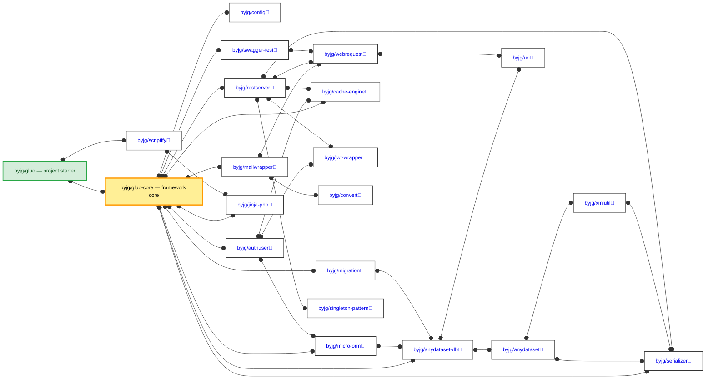

# PHP Components

## The Gluo Layout

Gluo is split into two packages:

- **byjg/gluo** — the project starter. This is what you type in `composer create-project byjg/gluo my-api`. It scaffolds a full-stack monorepo: the PHP REST API lives in `api/` (`api/src/`, `api/config/`, `api/db/`, `api/tests/`) and an optional Vite + React frontend lives in `html/`, with `docker-compose.yml` and `docker/` at the root. After creation the project is yours: the namespace is renamed, and every file belongs to you.
- **byjg/gluo-core** — the framework core, installed in `vendor/`. It provides the base classes (`BaseLoginController`, `BaseRepository`, `BaseService`, `BaseUser`), the attributes (`RequireAuthenticated`, `RequireRole`, `ValidateRequest`), utilities (`JwtContext`, `OpenApiContext`, `FakeApiRequester`), the builder (migration, OpenAPI generation, code generator) and the test harness. Improvements arrive with a plain `composer update`.

`byjg/gluo-core` is the glue ("gluo" is Esperanto for glue) that binds the byjg components into a REST architecture.

## Class Dependency

```mermaid
graph LR;
  byjg/gluo[byjg/gluo — project starter];
  byjg/gluo-core[byjg/gluo-core — framework core];
  byjg/scriptify[<a href='https://opensource.byjg.com/docs/php/scriptify' style='text-decoration:none'>byjg/scriptify🔗</a>];
  byjg/config[<a href='https://opensource.byjg.com/docs/php/config' style='text-decoration:none'>byjg/config🔗</a>];
  byjg/anydataset-db[<a href='https://opensource.byjg.com/docs/php/anydataset-db' style='text-decoration:none'>byjg/anydataset-db🔗</a>];
  byjg/micro-orm[<a href='https://opensource.byjg.com/docs/php/micro-orm' style='text-decoration:none'>byjg/micro-orm🔗</a>];
  byjg/authuser[<a href='https://opensource.byjg.com/docs/php/authuser' style='text-decoration:none'>byjg/authuser🔗</a>];
  byjg/mailwrapper[<a href='https://opensource.byjg.com/docs/php/mailwrapper' style='text-decoration:none'>byjg/mailwrapper🔗</a>];
  byjg/restserver[<a href='https://opensource.byjg.com/docs/php/restserver' style='text-decoration:none'>byjg/restserver🔗</a>];
  byjg/swagger-test[<a href='https://opensource.byjg.com/docs/php/swagger-test' style='text-decoration:none'>byjg/swagger-test🔗</a>];
  byjg/migration[<a href='https://opensource.byjg.com/docs/php/migration' style='text-decoration:none'>byjg/migration🔗</a>];
  byjg/jinja-php[<a href='https://opensource.byjg.com/docs/php/jinja-php' style='text-decoration:none'>byjg/jinja-php🔗</a>];
  byjg/cache-engine[<a href='https://opensource.byjg.com/docs/php/cache-engine' style='text-decoration:none'>byjg/cache-engine🔗</a>];
  byjg/serializer[<a href='https://opensource.byjg.com/docs/php/serializer' style='text-decoration:none'>byjg/serializer🔗</a>];
  byjg/anydataset[<a href='https://opensource.byjg.com/docs/php/anydataset' style='text-decoration:none'>byjg/anydataset🔗</a>];
  byjg/xmlutil[<a href='https://opensource.byjg.com/docs/php/xmlutil' style='text-decoration:none'>byjg/xmlutil🔗</a>];
  byjg/uri[<a href='https://opensource.byjg.com/docs/php/uri' style='text-decoration:none'>byjg/uri🔗</a>];
  byjg/jwt-wrapper[<a href='https://opensource.byjg.com/docs/php/jwt-wrapper' style='text-decoration:none'>byjg/jwt-wrapper🔗</a>];
  byjg/convert[<a href='https://opensource.byjg.com/docs/php/convert' style='text-decoration:none'>byjg/convert🔗</a>];
  byjg/webrequest[<a href='https://opensource.byjg.com/docs/php/webrequest' style='text-decoration:none'>byjg/webrequest🔗</a>];
  byjg/singleton-pattern[<a href='https://opensource.byjg.com/docs/php/singleton-pattern' style='text-decoration:none'>byjg/singleton-pattern🔗</a>];

  byjg/gluo o--o byjg/gluo-core;
  byjg/gluo o--o byjg/scriptify;

  byjg/gluo-core o--o byjg/config;
  byjg/gluo-core o--o byjg/anydataset-db;
  byjg/gluo-core o--o byjg/micro-orm;
  byjg/gluo-core o--o byjg/authuser;
  byjg/gluo-core o--o byjg/mailwrapper;
  byjg/gluo-core o--o byjg/restserver;
  byjg/gluo-core o--o byjg/swagger-test;
  byjg/gluo-core o--o byjg/migration;
  byjg/gluo-core o--o byjg/jinja-php;
  byjg/gluo-core o--o byjg/cache-engine;
  byjg/gluo-core o--o byjg/serializer;

  byjg/anydataset-db o--o byjg/anydataset;
  byjg/anydataset-db o--o byjg/uri;

  byjg/anydataset o--o byjg/serializer;
  byjg/anydataset o--o byjg/xmlutil;

  byjg/xmlutil o--o byjg/serializer;

  byjg/micro-orm o--o byjg/anydataset-db;

  byjg/authuser o--o byjg/cache-engine;
  byjg/authuser o--o byjg/jwt-wrapper;
  byjg/authuser o--o byjg/micro-orm;

  byjg/mailwrapper o--o byjg/convert;
  byjg/mailwrapper o--o byjg/webrequest;

  byjg/webrequest o--o byjg/uri;

  byjg/restserver o--o byjg/cache-engine;
  byjg/restserver o--o byjg/jwt-wrapper;
  byjg/restserver o--o byjg/serializer;
  byjg/restserver o--o byjg/singleton-pattern;
  byjg/restserver o--o byjg/webrequest;

  byjg/swagger-test o--o byjg/webrequest;

  byjg/migration o--o byjg/anydataset-db;

  byjg/scriptify o--o byjg/jinja-php;

  classDef default fill:#ffffff,stroke:#333,stroke-width:1.5px,color:#000,font-size:14px;
  classDef highlight fill:#ffef96,stroke:#ff9900,stroke-width:3px;
  classDef main fill:#d4edda,stroke:#28a745,stroke-width:2px,color:#155724;

  class byjg/gluo main;
  class byjg/gluo-core highlight;
```

## Component Description

### Your project (byjg/gluo starter)

The starter keeps its own dependencies to a minimum:

- **byjg/gluo-core** - The Gluo framework core (see below)
- **byjg/scriptify** - Transform any PHP class into an executable script callable from the command line (used by `composer terminal`)

Everything else arrives through `byjg/gluo-core`, so a framework upgrade is a single `composer update byjg/gluo-core`.

### Framework core dependencies (byjg/gluo-core)

The core binds these byjg components together:

- **byjg/config** - A very basic and minimalist PSR-11 implementation for config management and dependency injection
- **byjg/anydataset-db** - Relational database abstraction layer, part of the Anydataset project
- **byjg/micro-orm** - A micro framework for creating a very simple decoupled ORM
- **byjg/authuser** - Simple and customizable library for user authentication using repository and service layer architecture
- **byjg/mailwrapper** - Lightweight wrapper for sending email with a decoupled interface
- **byjg/restserver** - Create RESTful services with customizable output handlers and auto-generate routes from swagger.json
- **byjg/swagger-test** - Tools for testing REST calls based on the OpenAPI specification using PHPUnit
- **byjg/migration** - Framework-agnostic database migration tool using pure SQL commands
- **byjg/jinja-php** - Lightweight PHP implementation of the Jinja2 template engine (powers the code generator templates)
- **byjg/cache-engine** - PSR-6 and PSR-16 cache implementation
- **byjg/serializer** - Serialization utilities for JSON, XML, and YAML

### Core Infrastructure Components

These are the foundational components used by multiple dependencies:

- **byjg/anydataset** - Agnostic data source abstraction layer
- **byjg/xmlutil** - XML manipulation utilities
- **byjg/uri** - URI manipulation and PSR-7 HTTP message support
- **byjg/jwt-wrapper** - JWT token handling wrapper
- **byjg/webrequest** - PSR-18 HTTP client implementation
- **byjg/convert** - Conversion utilities
- **byjg/singleton-pattern** - Singleton pattern implementation

## Dependency Legend

- **o--o** - Required dependency (composer require)
- **Green** - Your project (the byjg/gluo starter)
- **Yellow** - The Gluo framework core (updatable via composer)
- **White** - Component dependencies

## External Dependencies

The project also depends on several external packages:

- **zircote/swagger-php** - Generate interactive documentation for RESTful APIs using PHP attributes
- Various PSR interfaces (PSR-3, PSR-6, PSR-7, PSR-11, PSR-16, PSR-18)
- **symfony/** components (yaml, console, etc.)
- **firebase/php-jwt** - JWT implementation
- **phpmailer/phpmailer** - Email sending library
- **aws/aws-sdk-php** - AWS SDK for PHP (used by mailwrapper)
