# PHP Components

## Class Dependency

```mermaid
graph LR;
  byjg/rest-reference-architecture[<a href='https://opensource.byjg.com/docs/php/rest-reference-architecture' style='text-decoration:none'>byjg/rest-reference-architecture🔗</a>];
  byjg/config[<a href='https://opensource.byjg.com/docs/php/config' style='text-decoration:none'>byjg/config🔗</a>];
  byjg/anydataset-db[<a href='https://opensource.byjg.com/docs/php/anydataset-db' style='text-decoration:none'>byjg/anydataset-db🔗</a>];
  byjg/micro-orm[<a href='https://opensource.byjg.com/docs/php/micro-orm' style='text-decoration:none'>byjg/micro-orm🔗</a>];
  byjg/authuser[<a href='https://opensource.byjg.com/docs/php/authuser' style='text-decoration:none'>byjg/authuser🔗</a>];
  byjg/mailwrapper[<a href='https://opensource.byjg.com/docs/php/mailwrapper' style='text-decoration:none'>byjg/mailwrapper🔗</a>];
  byjg/restserver[<a href='https://opensource.byjg.com/docs/php/restserver' style='text-decoration:none'>byjg/restserver🔗</a>];
  byjg/swagger-test[<a href='https://opensource.byjg.com/docs/php/swagger-test' style='text-decoration:none'>byjg/swagger-test🔗</a>];
  byjg/migration[<a href='https://opensource.byjg.com/docs/php/migration' style='text-decoration:none'>byjg/migration🔗</a>];
  byjg/scriptify[<a href='https://opensource.byjg.com/docs/php/scriptify' style='text-decoration:none'>byjg/scriptify🔗</a>];
  byjg/shortid[<a href='https://opensource.byjg.com/docs/php/shortid' style='text-decoration:none'>byjg/shortid🔗</a>];
  byjg/jinja-php[<a href='https://opensource.byjg.com/docs/php/jinja-php' style='text-decoration:none'>byjg/jinja-php🔗</a>];
  byjg/anydataset[<a href='https://opensource.byjg.com/docs/php/anydataset' style='text-decoration:none'>byjg/anydataset🔗</a>];
  byjg/serializer[<a href='https://opensource.byjg.com/docs/php/serializer' style='text-decoration:none'>byjg/serializer🔗</a>];
  byjg/xmlutil[<a href='https://opensource.byjg.com/docs/php/xmlutil' style='text-decoration:none'>byjg/xmlutil🔗</a>];
  byjg/uri[<a href='https://opensource.byjg.com/docs/php/uri' style='text-decoration:none'>byjg/uri🔗</a>];
  byjg/cache-engine[<a href='https://opensource.byjg.com/docs/php/cache-engine' style='text-decoration:none'>byjg/cache-engine🔗</a>];
  byjg/jwt-wrapper[<a href='https://opensource.byjg.com/docs/php/jwt-wrapper' style='text-decoration:none'>byjg/jwt-wrapper🔗</a>];
  byjg/convert[<a href='https://opensource.byjg.com/docs/php/convert' style='text-decoration:none'>byjg/convert🔗</a>];
  byjg/webrequest[<a href='https://opensource.byjg.com/docs/php/webrequest' style='text-decoration:none'>byjg/webrequest🔗</a>];
  byjg/singleton-pattern[<a href='https://opensource.byjg.com/docs/php/singleton-pattern' style='text-decoration:none'>byjg/singleton-pattern🔗</a>];

  byjg/rest-reference-architecture o--o byjg/config;
  byjg/rest-reference-architecture o--o byjg/anydataset-db;
  byjg/rest-reference-architecture o--o byjg/micro-orm;
  byjg/rest-reference-architecture o--o byjg/authuser;
  byjg/rest-reference-architecture o--o byjg/mailwrapper;
  byjg/rest-reference-architecture o--o byjg/restserver;
  byjg/rest-reference-architecture o--o byjg/swagger-test;
  byjg/rest-reference-architecture o--o byjg/migration;
  byjg/rest-reference-architecture o--o byjg/scriptify;
  byjg/rest-reference-architecture o--o byjg/shortid;
  byjg/rest-reference-architecture o--o byjg/jinja-php;

  byjg/anydataset-db o--o byjg/anydataset;
  byjg/anydataset-db o--o byjg/uri;

  byjg/anydataset o--o byjg/serializer;
  byjg/anydataset o--o byjg/xmlutil;

  byjg/xmlutil o--o byjg/serializer;

  byjg/micro-orm o--o byjg/anydataset-db;

  byjg/authuser o--o byjg/cache-engine;
  byjg/authuser o--o byjg/jwt-wrapper;
  byjg/authuser o--o byjg/micro-orm;

  byjg/mailwrapper o--o byjg/convert;
  byjg/mailwrapper o--o byjg/webrequest;

  byjg/webrequest o--o byjg/uri;

  byjg/restserver o--o byjg/cache-engine;
  byjg/restserver o--o byjg/jwt-wrapper;
  byjg/restserver o--o byjg/serializer;
  byjg/restserver o--o byjg/singleton-pattern;
  byjg/restserver o--o byjg/webrequest;

  byjg/swagger-test o--o byjg/webrequest;

  byjg/migration o--o byjg/anydataset-db;

  byjg/scriptify o--o byjg/jinja-php;

  classDef default fill:#ffffff,stroke:#333,stroke-width:1.5px,color:#000,font-size:14px;
  classDef highlight fill:#ffef96,stroke:#ff9900,stroke-width:3px;
  classDef main fill:#d4edda,stroke:#28a745,stroke-width:2px,color:#155724;

  class byjg/rest-reference-architecture main;
```

## Component Description

This diagram shows the dependency relationships between the PHP components used in the REST Reference Architecture project.

### Direct Dependencies

The project directly depends on the following byjg components:

- **byjg/config** - A very basic and minimalist PSR-11 implementation for config management and dependency injection
- **byjg/anydataset-db** - Relational database abstraction layer, part of the Anydataset project
- **byjg/micro-orm** - A micro framework for creating a very simple decoupled ORM
- **byjg/authuser** - Simple and customizable library for user authentication using repository and service layer architecture
- **byjg/mailwrapper** - Lightweight wrapper for sending email with a decoupled interface
- **byjg/restserver** - Create RESTful services with customizable output handlers and auto-generate routes from swagger.json
- **byjg/swagger-test** - Tools for testing REST calls based on the OpenAPI specification using PHPUnit
- **byjg/migration** - Framework-agnostic database migration tool using pure SQL commands
- **byjg/scriptify** - Transform any PHP class into an executable script callable from the command line
- **byjg/shortid** - Create short string IDs from numbers
- **byjg/jinja-php** - Lightweight PHP implementation of the Jinja2 template engine

### Core Infrastructure Components

These are the foundational components used by multiple dependencies:

- **byjg/anydataset** - Agnostic data source abstraction layer
- **byjg/serializer** - Serialization utilities for JSON, XML, and YAML
- **byjg/xmlutil** - XML manipulation utilities
- **byjg/uri** - URI manipulation and PSR-7 HTTP message support
- **byjg/cache-engine** - PSR-6 and PSR-16 cache implementation
- **byjg/jwt-wrapper** - JWT token handling wrapper
- **byjg/webrequest** - PSR-18 HTTP client implementation
- **byjg/convert** - Conversion utilities
- **byjg/singleton-pattern** - Singleton pattern implementation

## Dependency Legend

- **o--o** - Required dependency (composer require)
- **Main (green)** - The main project (REST Reference Architecture)
- **Default (white)** - Standard dependencies

## External Dependencies

The project also depends on several external packages:

- **zircote/swagger-php** - Generate interactive documentation for RESTful APIs using PHP attributes
- Various PSR interfaces (PSR-3, PSR-6, PSR-7, PSR-11, PSR-16, PSR-18)
- **symfony/** components (yaml, console, etc.)
- **firebase/php-jwt** - JWT implementation
- **phpmailer/phpmailer** - Email sending library
- **aws/aws-sdk-php** - AWS SDK for PHP (used by mailwrapper)